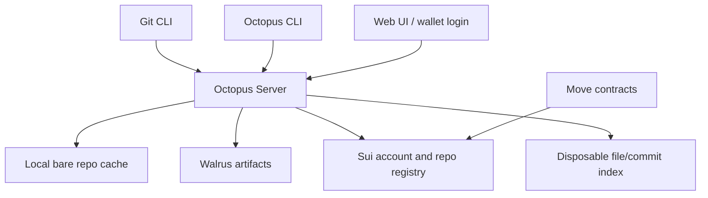
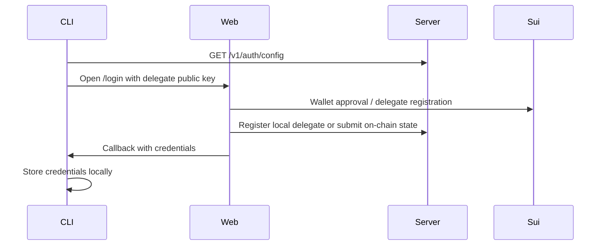
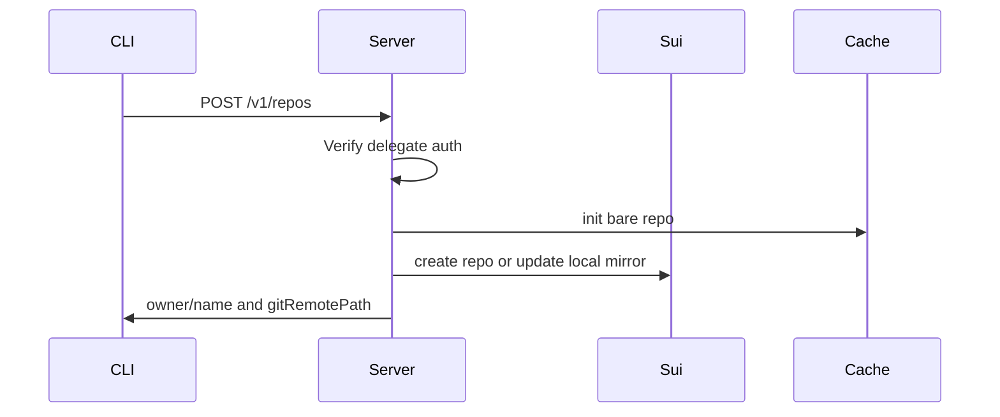
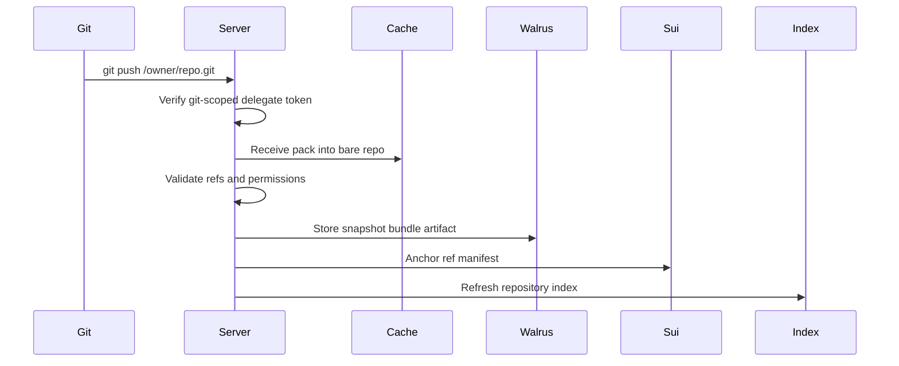
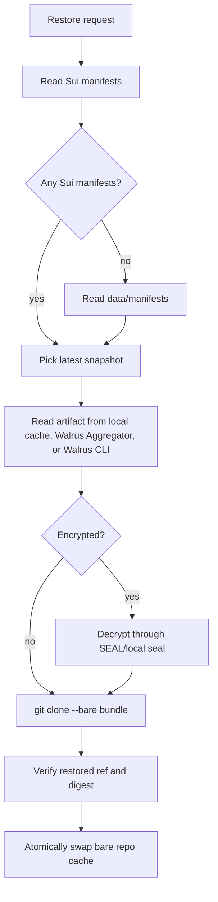

# Architecture

Octopus is a Git HTTP gateway, local cache, artifact writer, Sui ref registry,
and web/API surface.



## Main Components

| Component | Path | Responsibility |
|---|---|---|
| Server | `apps/server` | Git HTTP, REST API, HTML UI, auth verification, artifact creation, restore, indexing. |
| CLI | `apps/cli` | Wallet-backed login, delegate token generation, repo creation, Git remote setup, restore and PR commands. |
| Web app | `apps/web` | Wallet approval and web session login/unlock flow. |
| Shared package | `packages/shared` | Request schemas, auth header names, common parsing helpers. |
| Move contracts | `contracts/sui` | Account registry, repository registry, delegates, access control, ref manifests. |
| Specs | `specs` | Product, protocol, and acceptance source of truth. |

## Source Of Truth

Sui anchors:

- Account identity.
- Registered delegate keys.
- Repository identity.
- Repository owner and access roles.
- Visibility.
- Ref state and manifest metadata.

Walrus stores:

- Durable Git bundle artifacts.
- Encrypted private repository artifacts when SEAL mode is enabled.
- Metadata attributes that identify the Octopus repo, refs, digests, and actor.

Local state is rebuildable:

- Bare repository cache under `data/repos`.
- Local development Sui mirror under `data/sui`.
- Artifact manifests under `data/manifests`.
- Local Walrus fallback blobs under `data/walrus/blobs`.
- File, tree, commit, README, and contribution indexes.

## Login Flow



The CLI stores a delegate private key on the developer machine. REST requests
and Git HTTP requests carry `x-octopus-auth-token`, a signed delegate token with
the expected scope (`rest` or `git`).

## Repository Creation



Owner namespaces default to the authenticated wallet's primary SuiNS name when
available. If no SuiNS name is available, the wallet address is used.

## Push Flow



The current artifact writer creates snapshot bundles for changed durable refs
(`refs/heads/*` and `refs/tags/*`). Each manifest records commit transitions,
blob IDs, digests, visibility, encryption state, storage mode, and sequence
number.

## Clone And Fetch Flow

Git clone and fetch use normal Git HTTP paths:

```text
/<owner>/<repo>.git
```

When the local bare repo cache exists, the server serves Git directly from that
cache. If the cache is missing, restore should rebuild it from Sui manifests and
Walrus artifacts before serving.

## Restore Flow

Restore chooses the latest snapshot manifest. It prefers Sui-backed manifests
and falls back to local artifact manifests when running in development mode.



## Private Repositories

Private repository artifacts are encrypted before durable storage.

- `OCTOPUS_SEAL_MODE=local` uses deterministic local sealing for development.
- `OCTOPUS_SEAL_MODE=seal` uses `@mysten/seal` with configured key servers.
- Durable private pushes through Walrus CLI or relay require SEAL mode.

The SEAL approval path uses repository access state on Sui so key servers only
release shares to authorized readers.

## Boundaries And Non-Goals

Octopus keeps Git validity off-chain. The server is responsible for Git checks,
authorization, artifact digests, and restore verification. Sui stores compact
identity, access, and ref-manifest state rather than full Git object graphs.

Current deferred areas include full pull request review, issues, organization
and team permissions, code search, production indexer workers, and on-chain Git
DAG verification.
